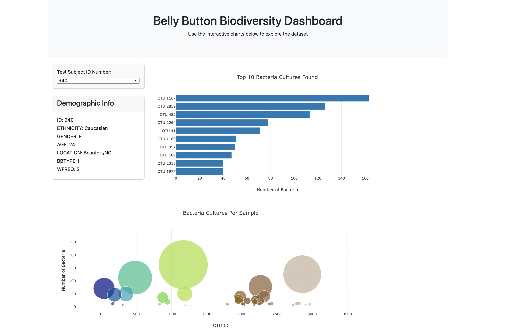

# biodiversity-dashboard

## Website: 
[website](https://github.com/JenniferVasquez1/biodiversity-dashboard/tree/main)

## Description
Built an interative dashboard to explore the Belly Button Biodiversity data set which catalogs the microbes that colonize human navels. The dataset reveals that a small handful of microbial species (also called operational taxonomic units, or OTUs, in the study) were present in more than 70% of people, while the rest were relatively rare.

## Table of Contents
- [Installation](#installation)
- [Usage](#usage)
- [Credits](#credits)
- [License](#license)
- [Features](#features)

- [Contact](#contact)

## Installation
python, javascript, html, json

## Usage
run js file and html

## Credits
Jennifer Harris

## License
MIT

## Features
html website, bar chart, bubble chart

## Contact
If there are any questions of concerns, I can be reached at:
##### [github: JenniferVasquez1](https://github.com/JenniferVasquez1)
##### [email: jennifer.v.harris@outlook.com](mailto:jennifer.v.harris@outlook.com)
